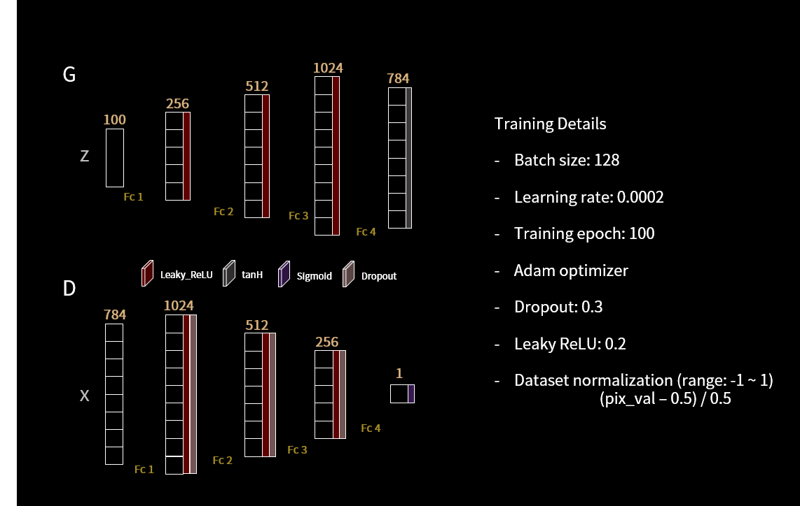

# pytorch-CelebA-DCGAN
Pytorch implementation of Generative Adversarial Networks (GAN) [1] and Deep Convolutional Generative Adversarial Networks (DCGAN) [2] for CelebA [3] datasets.

* If you want to train using cropped CelebA dataset, you have to change isCrop = False to isCrop = True.

* you can download
  - CelebA dataset: http://mmlab.ie.cuhk.edu.hk/projects/CelebA.html

* pytorch_CelebA_DCGAN.py requires 64 x 64 size image, so you have to resize CelebA dataset (celebA_data_preprocess.py).
* pytorch_CelebA_DCGAN.py added learning rate decay code.

## Implementation details
* GAN

* DCGAN

## Resutls
### CelebA
* Generate using fixed noise (fixed_z_)

<table align='center'>
<tr align='center'>
<td> DCGAN result</td>
<td> DCGAN loss </td>
</tr>
<tr>
<td>
<td>
</tr>
</table>

* CelebA vs Generated images

<table align='center'>
<tr align='center'>
<td> CelebA </td>
<td> DCGAN after 20 epochs </td>
</tr>
<tr>
<td>
<td>
</tr>
</table>

* Learning Time
  * CelebA DCGAN - Avg per epoch ptime: 753.31, total 20 epochs ptime: 15120.60

## Development Environment

* Ubuntu 14.04 LTS
* NVIDIA GTX 1080 ti
* cuda 8.0
* Python 2.7.6
* pytorch 0.1.12
* torchvision 0.1.8
* matplotlib 1.3.1
* imageio 2.2.0
* scipy 0.19.1

## Reference

[1] Goodfellow, Ian, et al. "Generative adversarial nets." Advances in neural information processing systems. 2014.

(Full paper: http://papers.nips.cc/paper/5423-generative-adversarial-nets.pdf)

[2] Radford, Alec, Luke Metz, and Soumith Chintala. "Unsupervised representation learning with deep convolutional generative adversarial networks." arXiv preprint arXiv:1511.06434 (2015).

(Full paper: https://arxiv.org/pdf/1511.06434.pdf)

[3] Liu, Ziwei, et al. "Deep learning face attributes in the wild." Proceedings of the IEEE International Conference on Computer Vision. 2015.
